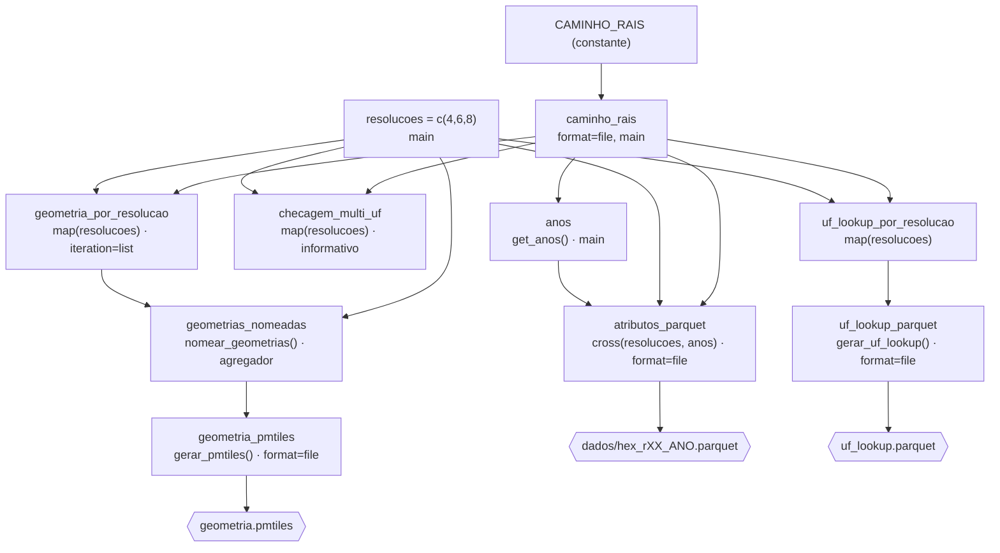

# Documentação do pipeline `_targets.R` — `grade_app`

> Gerado a partir de `_targets.R` e das funções em `R/`.
> Idioma de trabalho do projeto: **português (pt-BR)**.

Este documento explica:

1. [O que o pipeline faz e qual é a lógica geral do arquivo](#1-o-que-o-pipeline-faz)
2. [Inputs necessários](#2-inputs-necessários)
3. [Opções globais do pipeline (`tar_option_set`)](#3-opções-globais-do-pipeline)
4. [Como se formam as branches (ramificações)](#4-como-se-formam-as-branches)
5. [Cada target, um a um — o que é, como foi pensado](#5-cada-target-um-a-um)
6. [Grafo de dependências (DAG)](#6-grafo-de-dependências-dag)
7. [Outputs formados e utilidade de cada um](#7-outputs-formados-e-utilidade-de-cada-um)
8. [Comandos úteis](#8-comandos-úteis)
9. [Armadilhas conhecidas (não reintroduzir)](#9-armadilhas-conhecidas)

---

## 1. O que o pipeline faz

O `_targets.R` descreve um pipeline [`targets`](https://books.ropensci.org/targets/)
(framework de *make* para R) que transforma **a RAIS já agregada em hexágonos
H3** num conjunto de artefatos consumidos por um **dashboard web de mapa**.

A ideia central da arquitetura é a **separação entre geometria e atributos**:

| Camada | Muda com o tempo? | Como é gerada | Artefato |
|---|---|---|---|
| **Geometria** dos hexágonos | Não | 1 vez, por resolução | `geometria.pmtiles` |
| **Atributos** (`n_firmas`, `qt_vinc_ativos`) | Sim, ano a ano | 1 arquivo por resolução × ano | `dados/hex_rXX_ANO.parquet` |
| **Lookup administrativo** (`h3_address → uf`) | Raramente | 1 vez, por resolução | `uf_lookup.parquet` |

Por que separar: a geometria de um hexágono H3 é **fixa** — só depende do
endereço `h3_address`. O que muda de um ano para outro são os números
(empresas, vínculos). Se a geometria fosse regerada por ano, o `.pmtiles`
(116 MB) seria multiplicado por N anos sem necessidade. Em vez disso, o
navegador carrega a geometria **uma vez** e "cola" os atributos do ano
selecionado via *feature-state* do MapLibre, usando `h3_address` como chave.

### Lógica do arquivo `_targets.R`, de cima para baixo

1. **`library(...)`** — carrega `targets`, `tarchetypes`, `crew`.
2. **`tar_option_set(...)`** — define opções válidas para **todos** os targets
   (gestão de memória, pacotes, política de erro). Ver [seção 3](#3-opções-globais-do-pipeline).
3. **`tar_source("./R")`** — carrega **todas** as funções de `R/*.R`. Toda a
   lógica pesada vive nessas funções; o `_targets.R` só as **orquestra**.
4. **`CAMINHO_RAIS <- "./data/rais_test_20260727.parquet"`** — constante com o
   caminho do parquet de origem. É o único ponto a ajustar quando trocar de
   ambiente/base.
5. **`list(...)`** — a lista de `tar_target(...)`. É o "plano". O `targets`
   monta o grafo de dependências a partir dela (quem usa a saída de quem) e
   decide o que precisa (re)rodar.

Regra de ouro do projeto: **não existe um alvo intermediário com a tabela
inteira da RAIS em memória.** O único alvo de entrada é o **caminho** (string).
Cada função abre o parquet com `arrow::open_dataset()`, empurra `filter()` /
`group_by()` / `summarise()` para o Arrow (execução *lazy*, fora da RAM) e só
faz `collect()` da **fatia** que aquela branch precisa. Isso mantém o consumo
de memória baixo e deixa cada branch independente.

---

## 2. Inputs necessários

### 2.1. Arquivo de entrada (obrigatório)

**`./data/rais_test_20260727.parquet`** — apontado pela constante
`CAMINHO_RAIS` no topo do `_targets.R`.

É a RAIS **já agregada** em células H3, em **múltiplas resoluções na mesma
tabela**. Schema esperado:

| Coluna | Tipo | Descrição |
|---|---|---|
| `h3_res` | inteiro | Resolução H3 da linha: `4`, `6` ou `8`. |
| `h3_address` | string | Endereço da célula H3 (chave da geometria e dos joins no dashboard). |
| `ano` | inteiro | Ano de referência. |
| `uf` | **list-column** `list<string>` | UF(s) que a célula toca. É lista porque um hexágono de fronteira toca mais de uma UF. |
| `n_firmas` | numérico | Nº de firmas na célula, naquele ano. |
| `qt_vinc_ativos` | numérico | Nº de vínculos ativos na célula, naquele ano. |

Observações:

- **Os anos NÃO são hardcoded.** O alvo `anos` lê os valores distintos de
  `ano` direto do parquet (`get_anos()`). Adicionar um novo dump com um ano a
  mais faz o pipeline detectar e processar só as branches novas.
- As **resoluções** também têm um único ponto de definição: `c(4, 6, 8)` no
  alvo `resolucoes`. O parquet de teste atual tem 3 resoluções × 2 anos
  (2013 e 2023) → 6 arquivos em `dados/`.

### 2.2. Ambiente R e pacotes

Declarados em `tar_option_set(packages = c(...))` — o `targets` garante que
estejam carregados em cada worker:

| Pacote | Papel no pipeline |
|---|---|
| `arrow` | Ler o parquet *lazy* (`open_dataset`), escrever os parquets de saída (`write_parquet`). |
| `dplyr` | Verbos de transformação (`filter`, `group_by`, `summarise`, `distinct`, ...). |
| `h3jsr` | `cell_to_polygon()` — converte `h3_address` em polígono da célula. **Não roda *lazy*** → só depois do `collect()`. |
| `purrr` | `map_chr()` para achatar a list-column `uf`. |
| `sf` | `st_as_sf()` — transforma o data frame com coluna `geometry` em objeto espacial (CRS 4326). |
| `freestiler` | `freestile()` — empacota as geometrias em `.pmtiles` (chama o `tippecanoe` por baixo). |
| `tarchetypes` | Helpers do ecossistema `targets` (carregado por precaução; o pipeline atual usa só `tar_target`). |

Além disso, no `_targets.R`: `targets`, `crew` (controller paralelo — hoje
**comentado**, ver [seção 3](#3-opções-globais-do-pipeline)).

Ferramenta de sistema: o `freestiler` normalmente exige o **`tippecanoe`**
instalado e no `PATH` para gerar o `.pmtiles`.

### 2.3. Estrutura de pastas esperada

```
grade_app/
├── _targets.R              # o pipeline (este documento descreve ele)
├── R/                      # funções, carregadas por tar_source("./R")
├── data/
│   └── rais_test_20260727.parquet   # INPUT
├── dados/                  # OUTPUT: hex_rXX_ANO.parquet (criado se não existir)
├── logs/                   # logs (crew_workers/ quando o paralelismo é ligado)
├── _targets/               # cache/metadados do targets (NÃO versionar)
├── geometria.pmtiles       # OUTPUT
└── uf_lookup.parquet       # OUTPUT
```

`dados/` é criado automaticamente por `exportar_atributos_parquet()` se não
existir.

---

## 3. Opções globais do pipeline

`tar_option_set()` no `_targets.R`:

| Opção | Valor | Por que |
|---|---|---|
| `memory` | `"transient"` | Descarrega cada alvo da RAM assim que deixa de ser necessário — junto com o padrão "só o caminho, nunca a tabela toda", mantém o pico de memória baixo. |
| `garbage_collection` | `TRUE` | Roda `gc()` entre alvos. Idem — pipeline lida com `sf` e parquets grandes. |
| `trust_timestamps` | `TRUE` | Usa data de modificação para decidir se um arquivo mudou (mais rápido que hashear sempre). |
| `error` | `"null"` | Se uma branch falha, o alvo dela vira `NULL` e o pipeline **continua** as outras, em vez de abortar tudo. Erros ficam em `tar_meta(fields = error)`. |
| `packages` | vetor da [seção 2.2](#22-ambiente-r-e-pacotes) | Pacotes carregados em cada processo/worker. |
| `controller` / `storage` / `retrieval` | **comentados** | Bloco `crew_controller_local(workers = 6)` + `storage/retrieval = "worker"` está pronto mas desligado. Quando ligado, as branches (geometria/atributos/lookup por resolução × ano são independentes) rodam em paralelo em até 6 workers. Ver armadilha nº 7 na [seção 9](#9-armadilhas-conhecidas): com `retrieval = "worker"`, alvos base de `pattern` (`anos`, `resolucoes`) **precisam** de `deployment = "main"`. |

---

## 4. Como se formam as branches

O `targets` cria alvos dinamicamente ("dynamic branching") a partir do
argumento **`pattern`** de `tar_target()`. Cada branch é um sub-alvo com hash
próprio, cacheado e (re)executado individualmente.

### 4.1. `pattern = map(x)` — uma branch por elemento de `x`

Usado em `checagem_multi_uf`, `geometria_por_resolucao`, `uf_lookup_por_resolucao`.

`resolucoes = c(4, 6, 8)` → **3 branches**. A branch 1 roda a função com
`resolucao = 4`, a branch 2 com `6`, a branch 3 com `8`.

Repare que o **`_targets.R` passa o vetor plural** (`resolucoes`) para a
função cujo parâmetro é **singular** (`resolucao`). Isso é intencional: sob
`pattern = map(resolucoes)`, o `targets` substitui, em cada branch, o vetor
inteiro pelo **elemento escalar** daquela branch. A função nunca vê o vetor.

```r
tar_target(
  name    = geometria_por_resolucao,
  command = preparar_geometria(caminho_rais, resolucoes),  # 'resolucoes' -> escalar por branch
  pattern = map(resolucoes),
  iteration = "list"
)
```

### 4.2. `pattern = cross(x, y)` — uma branch por combinação

Usado em `atributos_parquet`.

`cross(resolucoes, anos)` com `resolucoes = c(4,6,8)` e `anos = c(2013, 2023)`
→ **3 × 2 = 6 branches**: `(4,2013) (4,2023) (6,2013) (6,2023) (8,2013) (8,2023)`.
Cada branch gera **um** arquivo `dados/hex_rXX_ANO.parquet`.

Com `format = "file"`, cada `.parquet` de saída é rastreado individualmente:
se só um ano novo entra na base, só as branches daquele ano reprocessam; as
dos anos antigos ficam em cache.

### 4.3. `iteration = "list"` (crítico em `geometria_por_resolucao`)

O padrão (`iteration = "vector"`) faz o `targets` **empilhar** os resultados
das branches num objeto só (`rbind` para data frame / `sf`). Aqui isso seria
errado: `nomear_geometrias()` precisa das 3 geometrias **separadas** para dar
o nome `h3_r04` / `h3_r06` / `h3_r08` a cada uma. `iteration = "list"` mantém
uma **lista de 3 elementos**, um por branch.

### 4.4. `deployment = "main"` (em `caminho_rais`, `anos`, `resolucoes`)

Força o alvo a ser calculado no **processo principal**, não num worker.

- `caminho_rais`: é trivial (uma string) e evita complicação de branching.
- `anos` e `resolucoes`: são a **base** dos `pattern = map()/cross()` dos
  alvos seguintes. O `targets` precisa desses valores **disponíveis no
  processo principal** na hora de *planejar* o branching. Se ficarem "presos"
  num worker (o que acontece com `retrieval = "worker"`), o planejamento vê um
  alvo vazio e aborta com `cannot branch over empty target`.

### 4.5. Alvos "agregadores" (sem `pattern`)

`geometrias_nomeadas`, `geometria_pmtiles`, `uf_lookup_parquet` **não** têm
`pattern`: eles **recebem todas as branches de uma vez** e consolidam.
Necessário porque `freestile()` e `bind_rows()` esperam a coleção inteira,
não um item por chamada.

### 4.6. Resumo da contagem de branches (parquet de teste atual)

| Alvo | `pattern` | Nº de branches |
|---|---|---|
| `checagem_multi_uf` | `map(resolucoes)` | 3 |
| `geometria_por_resolucao` | `map(resolucoes)` | 3 |
| `uf_lookup_por_resolucao` | `map(resolucoes)` | 3 |
| `atributos_parquet` | `cross(resolucoes, anos)` | 3 × 2 = 6 |
| resto | — | 1 cada |

---

## 5. Cada target, um a um

Ordem de declaração no `_targets.R`. Para cada alvo: **o que é**, **função
chamada**, **input → output**, **opções relevantes** e **por que foi pensado
assim**.

### 5.1. `caminho_rais`

```r
tar_target(caminho_rais, command = CAMINHO_RAIS,
           format = "file", deployment = "main")
```

- **O que é:** o **caminho** (string) do parquet de origem. **Não** é a
  tabela — é só o ponteiro para o arquivo.
- **`format = "file"`:** o `targets` rastreia o arquivo por hash/mtime. Se um
  novo dump da RAIS substituir o parquet, o `targets` detecta e marca como
  desatualizado **tudo** que depende dele.
- **`deployment = "main"`:** trivial, e evita problema de branching adiante.
- **Como foi pensado:** ponto único de entrada. Toda função de dado recebe
  este caminho e faz seu próprio `open_dataset() |> filter() |> collect()`.
  **Nunca** houve (e não deve haver) um alvo `rais` com o df completo —
  rejeitado por custo de memória em 2026-08-27. Também **nunca** fundir
  caminho + coleta no mesmo nome (`caminho_rais = carregar_rais(caminho_rais)`):
  o alvo passaria a depender de si mesmo, o grafo deixaria de ser DAG e
  `tar_make()` abortaria com erro de ciclo.

### 5.2. `anos`

```r
tar_target(anos, command = get_anos(caminho_rais), deployment = "main")
```

- **Função:** `get_anos(caminho_rais)` —
  `open_dataset() |> distinct(ano) |> collect() |> pull(ano) |> sort()`.
- **Input:** caminho do parquet. **Output:** vetor de anos ordenado
  (ex.: `c(2013, 2023)`).
- **Como foi pensado:** detectar os anos **a partir do dado**, nunca
  hardcode `2013:2023` — um hardcode quebraria em silêncio se um ano entrasse
  ou saísse da base. O `collect()` antes do `pull()` elimina uma deprecação do
  Arrow. `deployment = "main"`: é base de `pattern = cross(..., anos)`.

### 5.3. `resolucoes`

```r
tar_target(resolucoes, command = c(4, 6, 8), deployment = "main")
```

- **O que é:** o **único** lugar onde as resoluções H3 são definidas.
- **Como foi pensado:** mudar aqui propaga automaticamente para geometria,
  pmtiles, atributos e lookup — sem editar mais nada. `deployment = "main"`:
  é base de `pattern = map(resolucoes)` / `cross(resolucoes, ...)` em vários
  alvos; presa num worker → `cannot branch over empty target (resolucoes)`.

### 5.4. `checagem_multi_uf`  *(informativo — não bloqueia)*

```r
tar_target(checagem_multi_uf,
           command = checar_hexagonos_multi_uf(caminho_rais, resolucoes),
           pattern = map(resolucoes))
```

- **Função:** `checar_hexagonos_multi_uf(caminho_rais, resolucao)` — conta
  quantos `h3_address` daquela resolução aparecem com **mais de uma** `uf`
  distinta (hexágonos de fronteira administrativa).
- **Input:** caminho + resolução (escalar por branch).
  **Output:** um data frame `h3_address, n` (só os com `n > 1`) + uma
  `message()` com a contagem.
- **Como foi pensado:** é **só diagnóstico**. Não filtra, não altera geometria,
  não é consumido por nenhum outro alvo. Serve para você acompanhar a
  magnitude do fenômeno "hexágono toca 2+ UFs" (mais comum na resolução 4, que
  tem células maiores). Como `error = "null"`, mesmo se falhar não derruba o
  pipeline.

### 5.5. `geometria_por_resolucao`

```r
tar_target(geometria_por_resolucao,
           command = preparar_geometria(caminho_rais, resolucoes),
           pattern = map(resolucoes),
           iteration = "list")
```

- **Função:** `preparar_geometria(caminho_rais, resolucao)` —
  `open_dataset() |> filter(h3_res == resolucao) |> distinct(h3_address) |>
  collect() |> mutate(geometry = h3jsr::cell_to_polygon(h3_address)) |>
  st_as_sf(crs = 4326)`.
- **Input:** caminho + resolução. **Output:** um objeto `sf` — **uma linha
  por hexágono** daquela resolução, colunas `h3_address` + `geometry`.
- **Como foi pensado:**
  - A geometria carrega **só `h3_address`** — **nenhuma** coluna
    administrativa (`uf`, município...). Motivo: um hexágono pode tocar mais de
    uma UF; se `uf` entrasse no `distinct()`, o **mesmo** hexágono viraria
    várias linhas de geometria → hexágono desenhado 2+ vezes no `.pmtiles` →
    artefato visual no mapa. Já aconteceu numa versão anterior. Informação
    administrativa vive **só** no `uf_lookup.parquet`.
  - `cell_to_polygon()` **não** roda *lazy* no Arrow → o `collect()` vem
    **antes** do `mutate()`. Mas o `filter` + `distinct` são empurrados pro
    Arrow, então nunca se carrega a tabela inteira.
  - `iteration = "list"` é **essencial** (ver [4.3](#43-iteration--list-crítico-em-geometria_por_resolucao)).

### 5.6. `geometrias_nomeadas`

```r
tar_target(geometrias_nomeadas,
           command = nomear_geometrias(geometria_por_resolucao, resolucoes))
```

- **Função:** `nomear_geometrias(lista_geometrias, resolucoes_alvo)` —
  `setNames(lista, sprintf("h3_r%02d", resolucoes_alvo))`.
- **Input:** a **lista** de 3 `sf` do alvo anterior + o vetor de resoluções.
  **Output:** a mesma lista, agora **nomeada**: `list(h3_r04 = <sf>,
  h3_r06 = <sf>, h3_r08 = <sf>)`.
- **Como foi pensado:** alvo **agregador** (sem `pattern`) porque
  `freestile()` espera a lista inteira de uma vez. Os nomes `h3_r04/06/08`
  viram os **nomes das camadas** dentro do `.pmtiles`, e são exatamente os que
  o dashboard referencia (`sourceLayer: "h3_r04"`, etc.).

### 5.7. `geometria_pmtiles`  →  **`geometria.pmtiles`**

```r
tar_target(geometria_pmtiles,
           command = gerar_pmtiles(geometrias_nomeadas, "geometria.pmtiles"),
           format = "file")
```

- **Função:** `gerar_pmtiles(geometrias_nomeadas, caminho_saida)` — remove o
  arquivo antigo se existir e chama
  `freestiler::freestile(..., drop_rate = 2.5, coalesce = FALSE)`.
  Retorna o caminho do arquivo.
- **Input:** a lista nomeada de geometrias. **Output:** o arquivo
  `geometria.pmtiles` (≈116 MB, 3 camadas, ~103 mil features).
- **Como foi pensado:**
  - Gerado **UMA VEZ**, **não por ano** — é o ponto central da arquitetura
    (geometria não muda; atributo muda).
  - `format = "file"`: o `targets` rastreia o `.pmtiles` de saída e só
    regenera se as geometrias de entrada mudarem.
  - **`coalesce = FALSE` é obrigatório.** `TRUE` funde hexágonos adjacentes
    com atributos iguais e **destrói a identidade individual** de
    `h3_address` — que o *feature-state* no navegador precisa para colar o
    valor certo no hexágono certo.
  - `drop_rate = 2.5`: controla o *thinning* de features em zooms baixos.

### 5.8. `atributos_parquet`  →  **`dados/hex_rXX_ANO.parquet`**

```r
tar_target(atributos_parquet,
           command = exportar_atributos_parquet(caminho_rais, resolucoes, anos, "dados"),
           pattern = cross(resolucoes, anos),
           format = "file")
```

- **Funções:** `exportar_atributos_parquet(caminho_rais, resolucao, ano_alvo,
  diretorio_saida)` chama `preparar_atributos(caminho_rais, resolucao,
  ano_alvo)`:
  `open_dataset() |> filter(h3_res == resolucao, ano == ano_alvo) |>
  group_by(h3_address) |> summarise(n_firmas = sum(...), qt_vinc_ativos =
  sum(...)) |> collect()`. Depois `write_parquet()` em
  `dados/hex_r%02d_%d.parquet`.
- **Input:** caminho + (resolução, ano) escalares por branch.
  **Output:** um arquivo por branch — `dados/hex_r04_2013.parquet`,
  `hex_r04_2023.parquet`, `hex_r06_2013.parquet`, ... (6 no total hoje).
  Colunas: `h3_address`, `n_firmas`, `qt_vinc_ativos`.
- **Como foi pensado:**
  - O **ano vai no NOME do arquivo**, não numa coluna. Assim o dashboard
    carrega só o parquet do ano selecionado, sem filtrar coluna.
  - `cross(resolucoes, anos)` + `format = "file"`: granularidade fina de
    cache — ano novo na base ⇒ só as branches daquele ano reprocessam.
  - As somas são escritas **coluna a coluna** (não `across()`) — mais seguro
    no backend Arrow.
  - Se uma combinação vier com 0 linhas, a função emite `warning()` e retorna
    `NA_character_` (não escreve arquivo). Com `error = "null"`, isso não
    derruba o pipeline.

### 5.9. `uf_lookup_por_resolucao`

```r
tar_target(uf_lookup_por_resolucao,
           command = preparar_uf_lookup_parcial(caminho_rais, resolucoes),
           pattern = map(resolucoes))
```

- **Função:** `preparar_uf_lookup_parcial(caminho_rais, resolucao)` —
  `open_dataset() |> filter(h3_res == resolucao) |> select(h3_address, uf) |>
  collect() |> distinct(h3_address, uf) |> mutate(uf = map_chr(uf, 1))`.
- **Input:** caminho + resolução. **Output:** data frame `h3_address, uf`
  (uf achatada de `list<string>` para string), uma branch por resolução.
- **Como foi pensado:**
  - Gerado **direto do parquet bruto**, **não** da geometria — porque a
    geometria (de propósito) não carrega mais `uf`.
  - `distinct()` e o achatamento da list-column rodam **em R, depois do
    `collect()`**: o Arrow não faz `distinct` em coluna aninhada
    (`uf` é `list<string>`).
  - É um pipeline **paralelo e independente** da geometria: um `h3_address`
    pode aparecer em **mais de uma linha** aqui (hexágono de fronteira) sem
    afetar a geometria em nada.

### 5.10. `uf_lookup_parquet`  →  **`uf_lookup.parquet`**

```r
tar_target(uf_lookup_parquet,
           command = gerar_uf_lookup(uf_lookup_por_resolucao, "uf_lookup.parquet"),
           format = "file")
```

- **Função:** `gerar_uf_lookup(lista_uf_por_resolucao, caminho_saida)` —
  `bind_rows(lista) |> write_parquet(caminho_saida)`.
- **Input:** as 3 branches de `uf_lookup_por_resolucao`.
  **Output:** `uf_lookup.parquet` (≈693 kB) — colunas `h3_address`, `uf`.
- **Como foi pensado:** alvo agregador. **Pode ter mais de uma linha por
  `h3_address`** (fronteira entre UFs) — isso é **esperado**. O dashboard trata
  com **subquery de existência**, nunca `JOIN` direto, para não duplicar o
  hexágono ao filtrar por estado/região.

---

## 6. Grafo de dependências (DAG)



Três sub-pipelines saem todos de `caminho_rais` e **não se cruzam**:

1. **Geometria:** `caminho_rais` → `geometria_por_resolucao` (3 branches) →
   `geometrias_nomeadas` → `geometria_pmtiles` → `geometria.pmtiles`.
2. **Atributos:** `caminho_rais` (+ `anos` + `resolucoes`) →
   `atributos_parquet` (6 branches) → `dados/hex_rXX_ANO.parquet`.
3. **Lookup UF:** `caminho_rais` → `uf_lookup_por_resolucao` (3 branches) →
   `uf_lookup_parquet` → `uf_lookup.parquet`.

`checagem_multi_uf` é um ramo-folha (ninguém consome) — só diagnóstico.

---

## 7. Outputs formados e utilidade de cada um

| Output | Alvo | Formato / tamanho | Conteúdo | Utilidade no dashboard |
|---|---|---|---|---|
| **`geometria.pmtiles`** | `geometria_pmtiles` | PMTiles, ≈116 MB, 3 camadas (`h3_r04`, `h3_r06`, `h3_r08`), ~103k features | Polígono de cada hexágono H3, **sem atributos**, chave `h3_address`. `coalesce = FALSE` → cada hexágono é uma feature única. | Camada de base do mapa (MapLibre). Carregada **uma vez**; o dashboard troca de camada conforme o zoom/resolução. Os valores são "colados" em runtime via *feature-state*, casando por `h3_address`. |
| **`dados/hex_rXX_ANO.parquet`** (6 arquivos) | `atributos_parquet` | Parquet, dezenas de kB a ~730 kB cada | `h3_address`, `n_firmas`, `qt_vinc_ativos` — **somados por hexágono** para aquela resolução e aquele ano. Ano **no nome do arquivo**. | O dashboard carrega só o arquivo da resolução + ano selecionados (via DuckDB-WASM / fetch direto) e aplica os valores como *feature-state* na geometria. Trocar o ano = baixar outro parquet pequeno, sem recarregar a geometria. |
| **`uf_lookup.parquet`** | `uf_lookup_parquet` | Parquet, ≈693 kB | `h3_address → uf` (pode ter várias linhas por hexágono, em fronteiras). | Permite ao dashboard **filtrar/classificar por estado ou região** (via SQL no DuckDB-WASM) **sem tocar na geometria** e sem `uf` inflar o `.pmtiles`. Uso correto: **subquery de existência** (`WHERE EXISTS (SELECT 1 FROM uf_lookup ...)`), nunca `JOIN` direto — senão hexágono de fronteira aparece em duplicata. |
| `checagem_multi_uf` (3 branches) | — | Objeto R em cache (não vira arquivo) | Contagem de hexágonos que tocam 2+ UFs, por resolução, + `message()` no log. | **Diagnóstico apenas.** Ajuda a dimensionar o efeito "fronteira" (maior na resolução 4). Não é consumido por nada. |

Artefatos auxiliares (não são saída do pipeline, mas aparecem na pasta):

- **`tar_visnetwork.html`** — visualização do DAG salva manualmente com
  `targets::tar_visnetwork(TRUE)`. Não versionar (está no `.gitignore`).
- **`_targets/`** — cache e metadados do `targets` (objetos das branches,
  hashes, progresso, erros). Não versionar.

---

## 8. Comandos úteis

Rodar a partir da pasta `grade_app/` (que tem o `_targets.R`):

```r
targets::tar_manifest(fields = c(name, command))  # lista alvos, valida o grafo
targets::tar_validate()                            # valida o pipeline
targets::tar_outdated(callr_function = NULL)        # o que está desatualizado
targets::tar_make()                                 # roda o pipeline
targets::tar_meta(fields = error, complete_only = TRUE) |> View()  # ver erros das branches
targets::tar_visnetwork(TRUE)                       # desenha o DAG
targets::tar_read(geometrias_nomeadas)              # inspeciona a saída de um alvo
targets::tar_read(atributos_parquet, branches = 1)  # inspeciona uma branch específica
```

Tempo de referência: `tar_make()` completo rodou em ~1min44s no parquet de
teste (0 erros), gerando os 3 tipos de output.

---

## 9. Armadilhas conhecidas

Regras que **já causaram bug** — não reintroduzir (fonte: `CLAUDE.md`):

1. **Um único alvo de entrada — o CAMINHO, nunca a tabela inteira em
   memória.** Não criar um alvo `rais`/`rais_df` que faça `collect()` da
   tabela toda (rejeitado por custo de memória em 2026-08-27). Cada função
   abre o dataset e coleta só a sua fatia.
2. **Nunca fundir caminho + coleta no mesmo nome de alvo**
   (`caminho_rais = carregar_rais(caminho_rais)`): o alvo passa a depender de
   si mesmo → não é mais DAG → `tar_make()` aborta com erro de ciclo.
3. **Toda função de dado recebe o CAMINHO** e faz
   `open_dataset() |> filter(...) |> <lazy> |> collect() |> <o que o Arrow
   não faz>` internamente.
4. **Geometria não carrega colunas administrativas** (`uf` etc.). Senão o
   mesmo hexágono vira linha duplicada no `.pmtiles` (artefato visual).
5. **`uf_lookup.parquet` pode ter mais de uma linha por `h3_address`** —
   esperado (fronteira). O consumidor usa subquery de existência, não `JOIN`.
6. **`freestile(coalesce = FALSE)` é obrigatório** — `TRUE` funde hexágonos e
   destrói a identidade de `h3_address` que o feature-state precisa.
7. **`iteration = "list"` em `geometria_por_resolucao` é essencial** — sem
   isso as 3 geometrias viram um objeto só e `nomear_geometrias()` não
   consegue nomear cada resolução.
8. **`resolucoes` e `anos` precisam de `deployment = "main"`** — são base de
   `pattern = map/cross`; presas num worker dão
   `cannot branch over empty target`.

### Dívidas técnicas registradas

- `carregar_rais()` está **definida duas vezes** (idêntica) em
  `R/carregar_rais.R` e `R/funcoes_targets_parquet_tile.R` e **não é mais
  usada** pelo pipeline (coletava a tabela inteira). Pode ser removida das
  duas.
- O bloco `crew_controller_local(workers = 6)` + `storage/retrieval =
  "worker"` está **comentado** no `_targets.R` — o pipeline roda serial hoje.
- Objetos órfãos no cache (`_targets/objects/rais`, `rais_df`) são de versões
  antigas do pipeline; serão limpos no próximo `tar_make()` / `tar_prune()`.
```
